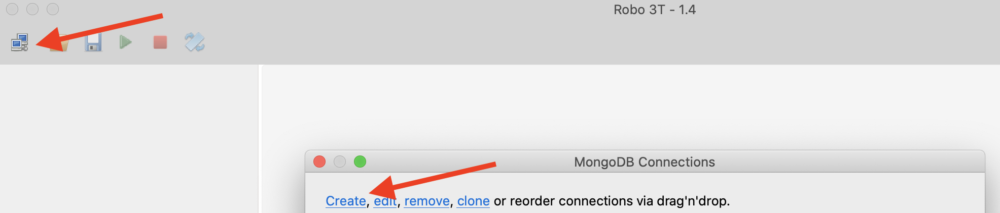
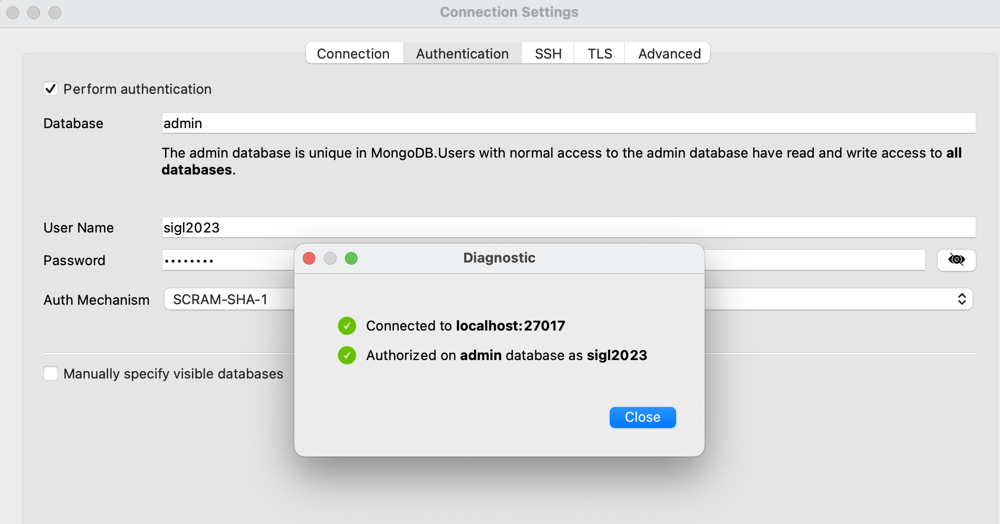

# MongoDB workshop

MongoDB is a NoSQL database, document oriented.

Find out more about some use cases Mongo is good for here:
- https://www.mongodb.com/use-cases

You will use this database to manage orders of your users.

## Step 1: Install Mongo

### Start mongo in a container

Like for postgres, you will use a `docker` setup.

Use the `docker-compose` provided:

```bash
# start mongo containers
docker-compose up -d
```

### Query mongo

#### Using mongo CLI

If you wish to visualized your data directly using MongoDB shell (CLI),
you can enter the MongoDB running container:

```bash
# from database/mongodb
docker compose exec mongodb mongo --username sigl2023 --password sigl2023
# >
# MongoDB shell version v5.0.3
# ...
# > 
```

Mongo CLI doc can be found on mongodb website:
- https://docs.mongodb.com/manual/mongo/#working-with-the-mongo-shell


#### Using Robot 3T (formally robotmongo)

Let's install a tool like pgAdmin for mongo.

We recommend using [Robo 3T free tool (download Robo 3T - not studio)](https://robomongo.org/download).

Once downloaded, you can add your mongo connection by:
1. click the connection icon and `create` a new connection. 

1. In the `Connection` tab, add `local` as a connection name (you can choose whichever name you like)

1. In the `Authentication` tab, tick `Perform authentication` and fill:
    - `admin` as database
    - `sigl2023` as User Name
    - `sigl2023` as Password
    - `SCRAM-SHA-1` as Auth Mechanism
1. Test your connection by clicking `! Test` button; you should see:

1. Save config if test is green as above, and you should be able to connect to your mongo db from the list of connections
1. Click connect, and you should have only a `config` collection and a `System` folder.

## Step 2: Create Socrate's database and order collection

### Create socrate database in Mongo

From Robot 3T, you can directly create a new database:
1. right click `local` > `Create database`
1. enter `socrate` as database name

### Create a schema ?

**There are no notions of database schema in MongoDB!**

You only talk about `collection` of `documents`.

### Create the orders collection

Let's create a collection name "comments" inside socrate database, from Robot 3T:
1. click `socrate` > right click `Collections` > add `Collection`
1. add `orders` as Collection name

You're all set!

> Note: Equivalent to create a new database with collection using MongoCLI would be:
> ```sh
> # Enter the mongo shell
> docker exec -it mongo-5 mongo -u sigl2023 -p sigl2023
> # MongoDB shell version 5.0.8
> #...
> use socrate
> # switched to db socrate
> db.createCollection("orders");
> # { "ok" : 1 }
> show collections;
> # will display your collections
> show databases; 
> # will display your databases
>```

## Step 3: Load some orders

> Note: comments are not really matching our garlarxy ressources, but it will do for our case!

This script is based on large file that we can't push on this repository.

Download [comments.tsv (https://files.groupe30.arla-sigl.fr/orders.json)](https://files.groupe30.socra-sigl.fr/data/orders.json) file and place it inside `scripts/data/orders.json` folder:

```sh
# from databases/mongodb/scripts/data/
wget https://files.group30.socra-sigl.fr/orders.json
```

To import those orders, you need to copy scripts folder (containing orders.json) inside the mongo container and import them using [mongoimport](https://docs.mongodb.com/database-tools/mongoimport/):
```bash
# from database/mongodb/
# copy your orders.json file to mongodb container
docker compose cp scripts mongodb:/tmp/
# Load all orders to the socrate database on the collection orders.
# Note: you need to authenticate as the user sigl2023 over the admin database to have
#       rights to perform data import.
# --drop is there to empty the collection before importing it again.
docker compose exec mongodb mongoimport -u sigl2023 -p sigl2023 \
    --authenticationDatabase=admin \
    --db=socrate \
    --collection=orders \
    --file=/tmp/scripts/data/orders.json \
    --drop
```

From Robot 3T, you can view all documents by double clicking on `orders` (or right click on `orders` > View documents)

> Note: You can choose different display options of your documents next to pagination menu

## Step 4: Query orders

Let's query all orders for the customer with id `8`.

In the MongoDB cli or from Robot 3T, enter:
```js
// If you are from MongoDB cli, make sure to type `use socrate` before
// (to be on the correct database) 
db.getCollection('orders').find({customer_id: 8});
```

> Note: You may have noticed that documents are like JSON documents but with some other types like `ObjectID`.
> The real format name of documents in Mongo is [BSON](https://www.mongodb.com/json-and-bson). It stands for Binary JSON, and adds more than > the 5 types of JSON (like `Date`, `NumberLong` etc...)

## Step 5: Expose orders on your Web API

### Create the orders service reading orders from MongoDB

**Objective** You want your web-api to read orders you've imported in mongo.

To interact from your node api with mongo, you will use the [mongodb](https://www.npmjs.com/package/mongodb) node module.

You will also install [body-parser](https://www.npmjs.com/package/body-parser) node modules, necessary for next step (to read/parse incomming POST body).

From your group's project, go in `backend/` folder and install mongodb node module:
```sh
# from backend/
nvm use v16
npm i --save mongodb body-parser
```

Then adapt the following changes:
- Add your database connection credentials to your existing  `backend/.env` file:
```sh
# inside backend/.env
# ...
DDB_HOST=localhost
DDB_PORT=27017
DDB_DATABASE=socrate
DDB_USER=sigl2023
DDB_PASSWORD=sigl2023
DDB_AUTH_SOURCE=admin
```
- Adapt `backend/src/database.js` to add a new `DDB` object:
```js
// ...
const { MongoClient } = require("mongodb");
// ...

const DDB = {
  config: {
    host: process.env.DDB_HOST,
    port: process.env.DDB_PORT,
    user: process.env.DDB_USER,
    database: process.env.DDB_DATABASE,
    password: process.env.DDB_PASSWORD,
    authSource: process.env.DDB_AUTH_SOURCE,
  },
  getMongoClient: function () {
    const uri = `mongodb://${this.config.user}:${this.config.password}@${this.config.host}:${this.config.port}/${this.config.database}?authSource=${this.config.authSource}`;
    return new MongoClient(uri, {
      useNewUrlParser: true,
      useUnifiedTopology: true,
    });
  },

  findPage: async function (
    collectionName,
    findQuery,
    skip,
    limit,
    sort = { _id: 1 }
  ) {
    let results;
    const client = this.getMongoClient();
    try {
      await client.connect();
      const database = client.db();
      const col = await database
        .collection(collectionName)
        .find(findQuery)
        .sort(sort)
        .skip(skip)
        .limit(limit);
      results = await col.toArray();
    } catch (e) {
      console.log('Mongo error: ', e);
    } finally {
      // Ensures that the client will close when you finish/error
      await client.close();
      return results;
    }
  },

  getOrderPage: async function (customerId, page, limit) {
    const skip = page * limit;
    const orders = await this.findPage(
      "orders",
      { customer_id: customerId },
      skip,
      limit,
      { created_at: -1 }
    );
    return orders;
  },
};

module.exports = {
    RDB,
    DDB
};
```
> Note: DDB stands for **D**ocument **D**ata**B**ase

- Also extend existing `RDB` object with a new `getCustomerByEmail` method to the  of `backend/src/database.js`:
```js
// ...
const RDB = {
    // ...
    getCustomerByEmail: async function (email) {
      const rows = await this.queryMany(`
        SELECT * from customer
        WHERE username = '${email}';
      `);
      return rows ? rows[0] : undefined;
    }
}
```
- And create a new `POST` route for `v1/orders` that fetch orders for a given user email. Modify `backend/src/server.js` with the following:
```js
// ...
const { RDB, DDB } = require("./database");
const bodyParser = require("body-parser");
// ...
app.use(bodyParser.json());

app.post("/v1/orders", async (req, res) => {
  const emailRegex = /^\w+([\.-]?\w+)*@\w+([\.-]?\w+)*(\.\w{2,3})+$/;
  try {
    const email = req.body.email;
    if (emailRegex.test(email)) {
      const customer = await RDB.getCustomerByEmail(email);
      if (customer) {
        // get last 5 orders
        const orders = await DDB.getOrderPage(customer.id, 0, 5);

        const response = orders.map(function (order) {
          return {
            id: order._id,
            createdAt: order.created_at,
            deliveredAt: order.delivered_at,
            price: order.order_price,
            status: order.status,
          };
        });
        res.send(response);
      } else {
        throw new Error("user not found");
      }
    } else {
      throw new Error("not a valid email");
    }
  } catch (e) {
    res.send({ error: e.message });
  }
});
```
About this code:
    - `app.use(bodyParser.json());` enables a middleware that add a JSON incomming `POST` body payload to the `req.body` object.
    Then you can access any `body` key like `req.body.mykey`.
    You are using it to recover the email from the incoming payload: `req.body.email`.
    - It makes sure email is valid syntax. This prevent to have some sql injection.
    - It first get the `customer.id` from the `RDB` based on the `email` of the customer.
    - Then it queries all documents for the given `customer.id` from the `DDB`.
    - It catches all kind of errors:
        - if user email is not valid
        - if user is not found for a given email
        - any other error of other kind

### Adapt your frontend to read orders from MongoDB

**Objective**: Replace orders from SocrateContext by the one returned from `POST /v1/orders`

- Create another function `postApi` inside `frontend/src/utils.js` with:
```js
// ...

export async function postApi(token, route, body) {
  const endpoint = `${SOCRATE_API_URL}${route}`;
  const response = await fetch(endpoint, {
    method: "POST",
    headers: {
      Authorization: `Bearer ${token}`,
      "Content-Type": "application/json",
    },
    body: JSON.stringify(body),
  });
  return await response.json();
}
```
- And adapt your `frontend/src/Orders.js` with:
```js
// ...
import { postApi } from "./utils";
import { useAuth0 } from "@auth0/auth0-react";
// ...
function Orders() {
  const { getAccessTokenSilently, user } = useAuth0();
  const [orders, setOrders] = React.useState([]);

  React.useEffect(() => {
    async function fetchOrders() {
      const token = await getAccessTokenSilently();
      const orders = await postApi(token, `/v1/orders`, { email: user.email });
      setOrders(orders);
    }
    fetchOrders();
  }, []);

  return //...
}
```
Instead of loading orders from the `SocrateContext`, you are now fetching orders from your Web-API!

### Test your order function

In order to test, create a new user in the Auth0 dashboard with an email that exists in the `customer` database. For instance `user1@socra-sigl.fr`.

Then login with this user, and you should see the orders from mongodb in the table.

## Challenge: Format order date with "ago" format

**Objective**: Modify `formatDate` method in `frontend/src/Orders.js` to display dates like "12 days ago" for the creation and delivery date of past orders.
You will use [date-fns](https://www.npmjs.com/package/date-fns) node module to convert dates to the "ago" format.

Date format should be made in the `frontend` part.

MongoDB is serving dates as `number` representing the date's timestamp in milliseconds.

To reconstruct this `number` to a javascript `Date` object, you can simply use `new Date(d)` where `d` is the `number` timestamp.

## Step 7: Adapt your CD

**Objective**: Like for postgres, you want your web-API to read from the production database when your web-API is deployed on production (e.g. on your group's Scaleway machine).

Like for postgres, we prepared a Mongo database where your web-api can read from in production.

Credentials are (adapt XX with your group number):
- Database host (`DDB_HOST`): pro.mongo.socra-sigl.fr
- Database port (`DDB_PORT`): 27017
- Database name (`DDB_DATABASE`): socra-group-XX
- Database user (`DDB_USER`): socra-group-XX
- Database password (`DDB_PASSWORD`): socra-group-XX
- Databae auth source (`DDB_AUTH_SOURCE`): socra-group-XX

Create the secrets above in your Github's group project Settings > Secrets.

You only have to adapt the existing `.env creation step` in your github workflow with the `DDB_` variables from your github secrets

You should be all set!

Just commit/push and you should be able to read comments from your group's project URL (e.g. groupXX.socra-sigl.fr)
