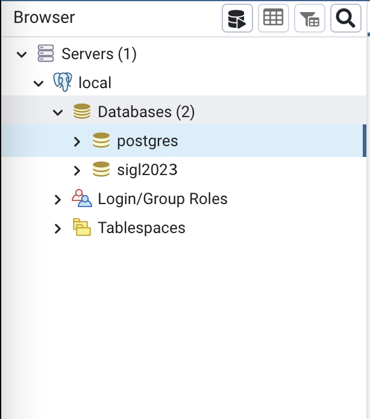
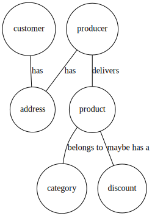

# Postgres (or PostgreSQL) workshop

[Postgres](https://www.postgresql.org) is an open source relationnal database managment system (RDBMS).

It's totally free and is use in production by many.

In this workshop, you will:
- Create Socrate's relational database schema
- Import test data we've created for you
- Visualize this data using [pgAdmin4](https://www.pgadmin.org)
- Query some data from the web API of previous workshop

## Step 1: Run Postgres and pgadmin on your computer

Postgres is your relationnal database where pgAdmin is a simple UI to help you manage your database (query, table creation etc...).

Instead of installing directly Postgres and pgAdmin on your local machine, you will run those in containers.

### docker-compose, docker network and docker volumes

We've created the [docker-compose.yaml](./docker-compose.yaml) for you.
> Note: [docker-compose](https://docs.docker.com/compose/) is a CLI tool that allows you to run multiple containers, describe in a `docker-compose.yaml` (or `docker-compose.yaml`)file.

Because pgAdmin docker image needs to access postgres docker image, they need to be on the same [docker network](https://docs.docker.com/network/).

Create a new external docker network for postgres:
```sh
# creates the postgres docker network
docker network create socrate-postgres
```

Then, you can just run containers describe in `docker-compose.yaml` by typing:
```sh
# start containers describe in the docker-compose.yaml file
# in daemon mode. Meaning, you'll start your containers in background
docker compose up -d
# Creating pgadmin4    ... done
# Creating postgres-14 ... done
```

> Note: two volumes are created to store pgAdmin4 config and all postgres data.
> those volumes are persisted until you remove them explicitly either:
>   - with `docker volume rm` command
>   - or with `docker compose down -v` (-v removes also container)

Check if your containers are running:
```sh
docker compose ps
# you should see your two containers in the list
```

### Connect to your database with pgAdmin

You should be able to access PgAdmin on [localhost:8040](http://localhost:8040/)
- usermail: socra@sigl.fr
- password: sigl2023

For PostgreSQL instance running locally, credentials are:
- user: sigl2023
- password: sigl2023

> Note: default credentials are in the docker-compose file

Once logged in add the local PostgreSQL:

1. Register server: right click on Servers > Register server

2. Enter a connection name (e.g. local)

3. Configure pgAdmin to connect to the postgres container:
- host: postgres-14
- username: sigl2023
- password: sigl2023

4. You should see postgres schema and sigl2023 schema in the server dropdown:



## Step 2: Create database and tables

Then, let's create Socrate's database core schema, with the following specifications:
- A **customer** can have one or more **address**es
- A **producer**:
  - can deliver many **product**s
  - can have one or more **address**
- A **product**
  - belongs to one or more **category**
  - may or maynot have a **discount**

Here is the corresponding entity-relation diagram (ERD), without table attributes:


To create database and tables, we've created necessary SQL files, so you just have to run them.

Those SQL scripts lives inside [postgresql/scripts/](scripts/) folder.

This folder exists on your local machine but **not inside the postgres container**.

Copy scripts to postgres container
```sh
# from postgresql/
docker compose cp scripts postgres:/tmp/
```

- Create SOCRATE database (script uses [CREATE DATABASE](https://www.postgresql.org/docs/current/sql-createdatabase.html) SQL statement):
```sh
# from postgresql/
docker compose exec postgres psql -U sigl2023 -f /tmp/scripts/create-database.sql
```

- Create SOCRATE's tables (script uses [CREATE TABLE](https://www.postgresql.org/docs/14/sql-createtable.html) SQL statement):
```sh
# from postgresql/
docker compose exec postgres psql -U sigl2023 -d socrate -f /tmp/scripts/create-tables.sql
```

You should see your tables in pgAdmin, under:
Server > local > databases > socrate > Schemas > public > Tables

Now we've created all tables, we need to add some data to it.

## Step 3: Import socrate data to your database

You will use the [COPY](https://www.postgresql.org/docs/12/sql-copy.html) command of postgres to import some data that we provided you with.

> Note: All test data lives under this `scripts/data` folder.
> It's a split / generated data based on an from [french's gouvernement open dataset](https://www.data.gouv.fr/fr/). The original dataset for this workshop is ["produit sude de france"](./utils/produits-sud-de-france.csv)
> We generated fake customer and customer addresses by sampling random geo location in a 250km radius from Dijon, France. Those positions are necessary for the computation of the carbon tax (based on the distance between producer address and customer address). We wrote [a python3 script to generate those random geo locations](./utils/generate-customer-addresses.py)
> Same for product discounts, we just randomly attributed discounts on 20% of the products. We wrote [another python3 script to generate fake discounts](./utils/generate-discounts.py)

Load data from CSV files into `socrate` database:
```sh
# From postgresql/
# execute the SQL script to import data from CSV files (see. scripts/load-data.sql)
docker compose exec postgres psql -U sigl2023 -d socrate -f /tmp/scripts/load-tables.sql
# This may take a minute...
# Output:
# COPY ...
# COPY ...
# ...
```

To explore your data, you can directly query some rows using pgAdmin's UI on http://localhost:8040 

**Important**: Make sure to refresh tables from the UI after loading data from previous step:
- go to socrate database > Schemas > public
- right click on Tables > Refresh

> **If you wish to start from scratch**, type the following commands:
> ```sh
> docker compose down -v
> docker network rm socrate-postgres
> ```
> 
> This will:
> - delete both pgadmin and postgres container
> - delete assiciated docker volumes
> - delete the socrate-postgres network
>

## Step 4: Create a view for products on discount

**Objective**: Let's create a [view](https://www.postgresql.org/docs/14/sql-createview.html) to query products on discount.

> Note: VIEW and MATERIALIZED VIEWS are differents. MATERIALIZED VIEWS is a PostgreSQL only feature where VIEW are default SQL views.
> You can read more here: https://www.postgresql.org/docs/14/rules-materializedviews.html

Let's use the SQL query tool from pgadmin4 to query products on discount.


We wish to select the follwing fields:
- `product.id`: the product ID on discount
- `product.name`: the product name on discount
- `producer.description`: we want to put the producer description for product description
- `image`: the `product.url_image` of the product
- `product.price`: the original product price without discount
- `discount`: the final price corresponding to `price - discount` rounded with 2 decimals
- `product_discount.valid_until`: the deadline date for the discount (discount are only valid until a certain date)

> Note: We want to match field names that you have in your backend/src/data/discounts_fr.json
> This will prevent you from any payload adaption on the frontend side (when rendering products/discounts).

To achieve this selection of table fields, you need to [JOIN](https://www.postgresql.org/docs/current/tutorial-join.html) `product` table with `product_discount` table on the `product id`.

The computation of the `final_price` can be done directly in the `SELECT` statement using `ROUND` and `CAST` builtin:
```sql
SELECT
  ...,
  ROUND(CAST((product.price - product_discount.discount) AS NUMERIC), 2) as discount
FROM ...
```

From your query tool in pgadmin4, type the following [JOIN](https://www.postgresql.org/docs/current/tutorial-join.html) query:
```sql
SELECT 
  product.id,
  product.name,
  product.price,
  product.url_image as image,
  producer.description,
  ROUND(CAST((product.price - product_discount.discount) AS NUMERIC), 2) as discount,
  product_discount.valid_until
FROM product
JOIN product_discount
ON product_discount.product_id = product.id
JOIN producer
ON producer.external_id = product.producer_external_id;
```

That's it! You should obtain all products on discounts.

Now create a new `postgresql/scripts/create-views.sql` (same folder as other SQL scripts) file:
```sql
CREATE VIEW product_on_discount AS
SELECT 
  product.id,
  product.name,
  product.price,
  product.url_image as image,
  producer.description,
  ROUND(CAST((product.price - product_discount.discount) AS NUMERIC), 2) as discount,
  product_discount.valid_until
FROM product
JOIN product_discount
ON product_discount.product_id = product.id
JOIN producer
ON producer.external_id = product.producer_external_id;
```

And run it on your local postgres:
```sh
# from postgresql/
docker compose cp scritps postgres:/tmp/
docker compose exec postgres psql -U sigl2023 -f /tmp/scripts/create-views.sql
```

From your pgAdmin UI, create a new view:
- Right click on `socrate > Schemas > public > Views` menu and select `Create > View`
- Name: `ressource_catalog`
- In the `Code` tab, just copy/paste the following `SELECT` statement

Now you can directly query your `product_on_discount` view:
- from the query tool, run the following SQL statement:
```sql
SELECT * FROM product_on_discount;
```

## Step 5 **Challenge**: Create a view of products in a category

**Objective**:
1. create `products_in_category` view with following field selection:
  - `id`: the **product** unique id
  - `name`: the name of the **product**
  - `description`: the **producer** description
  - `price`: the price of the **product** (ignore discounts)
  - `image`: the product's image URL
  - `categoryId`: the ID of the product's **category**
  - `categoryName`: the name of the product's **category**
1. add your `CREATE VIEW` statement to the `scripts/create-views.sql` script (keep the other view from previous step)

Some hints:
- you'll need 3 `JOIN` and start with the product table
- use the query tool from pgadmin4 when building your query
- use `product_id` and `category_id` from product_category table to join products and categories
- join `producer.external_id` and `product.producer_external_id` to get access to the producer's description

> Note: creating this view is **necessary** for next steps of this workshop

## Step 6: Expose your ressource catalog from your web API

**Objective**: Adapt your groupe's backend to read from PostgreSQL:
- products on discount
- products belonging to a category
- all product categories

From your group's API, you need to install a new node module to interact with Postgres: [node-postgres](https://node-postgres.com)

### Query products on discount

You will also install [dotenv](https://www.npmjs.com/package/dotenv) node module to manage database credentials on your different
environments (your machine and scaleway).

To install it, like any other node modules, type:
```sh
# from your backend/ folder (e.g. for group 13: groupe-13/backend)
# select correct version of node (v16)
nvm use v16
# from your web api repository
npm i --save pg dotenv
```

From your groupeXX/backend folder, create a new `.env` file with:
```sh
# inside backend/.env
RDB_HOST=localhost
RDB_PORT=5432
RDB_DATABASE=socrate
RDB_USER=sigl2023
RDB_PASSWORD=sigl2023
```

> Note: RDB stands for **R**elational **D**ata**B**ase

- Create a new `backend/src/database.js` file with:
```js
const process = require("process");
const { Pool } = require("pg");
const dotenv = require("dotenv");

dotenv.config();

const RDB = {
    // Create a pool of connection;
    // to control number of concurrent connections.
    // We leave default values for now.
    // Credentials for the RDB comes from the .env file
    pool: new Pool({
      host: process.env.RDB_HOST,
      port: +process.env.RDB_PORT, 
      database: process.env.RDB_DATABASE,
      user: process.env.RDB_USER,
      password: process.env.RDB_PASSWORD,
    }),
  
    /**
     * Helper to run SQL query on postgres.
     * @param {*} sql the query as string
     * @returns a list of all rows matching the query
     */
    queryMany: async function (sql) {
      // Get the next connection available in the pool
      const client = await this.pool.connect();
      const result = await client.query(sql);
      // release the connection
      client.release();
      return result.rows;
    },
  
    /**
     * Query a page of products on discount 
     * that are valid as of today
     * @returns a list of discounts
     */
    getAvailableDiscounts: async function (page, limit) {
      const rows = await this.queryMany(`
        SELECT * from product_on_discount
        LIMIT ${limit} OFFSET ${page};
      `)
      return rows;
    }
}

module.export {
  RDB
};
```
This new `RDB` module contains:
- `queryMany`: a helper function to help you query many rows providing sql code as string
- `getProductDiscounts` which will read a page of product on discount from the view you've created in previous step
- `dotenv.config()`: will load environment variables from the `.env` file created earlier. Environment variables are available in a global `process.env` object.

> Note: Because we could have many data, your query forces `page` and `limit` argument.
> This forces API consumer to query a limited amount of data.
> This is necessary when you want to implement paging in frontend:
>  - if `page = 0` and `limit = 10`, then the 10 first discounts will be return
>  - if `page = 1` and `limit = 10`, then 11th - 20th disounts will be return
> See. [LIMIT and OFFSET](https://www.postgresql.org/docs/current/queries-limit.html) SQL statement


Then adapt your `/v1/discounts` route in `backend/src/server.js` with:
```js
// ...
const { RDB } = require("./database");
// ...

app.get("/v1/discounts", async (req, res) => {
  try {
    const discounts = await RDB.getAvailableDiscounts(0, 4);
    res.send(discounts);
  } catch (e) {
    res.send({ error: e.message });
  }
});
// ...
```

- `async` keyword in the function's definition is necessary since reading data from postgreSQL is **asynchronous**.
- `await RDB.getAvailableDiscounts(1, 4);` will wait to receive the 4 first available discounts before sending discounts back to the client
- if anything goes wrong, server returns the error with the reason.

Then, start your api:
```sh
# from backend/
# select correct version of node
nvm use v16
node src/server.js
```

Start your frontend:
```sh
# from frontend/
# select correct version of node
nvm use v16
npm start
```

**Important**: Make sure your database is still running!

Login on your frontend, and you should see discounts coming from your postgresql!

## Challenge: Query categories from your database

**Objective**: Make your frontend query categories comming from PostgreSQL.
- adapt `backend`: 
  - create a new `getAllCategories()` function to read **all** data from the `category` table (no pages / limit necessary)
  - create it in `backend/src/database.js`'s RDB object
  - adapt your route in `backend/src/server.js` to use `getAllCategories` instead of the mock data in `backend/src/categories_fr.json`
- `frontend` should not need any adaptions
## Challenge: Query products in category from your database

**Objective**: Make your frontend query products in categroy comming from PostgreSQL.
- adapt `backend`: 
  - create a new `getProductsInCategory(categoryId, page, limit)` function to read a page of product matching the `categoryId` from the `products_in_category` view
  - create it in `backend/src/database.js`'s RDB object
  - adapt your route in `backend/src/server.js` to use `getProductsInCategory` instead of the mock data in `backend/src/products_fr.json`
- `frontend` should not need any adaptions

## Step 7: Make it work on production

We deployed a postgres for your application in production.

The production database is **not** open on internet but only in a private network
between your group's scaleway instances. 

This means you can access production database **only** from
your group's scaleway VM.

### Create views on the production PostgreSQL

You can connect to your postegres's production database from your local pgadmin4 instance
using an `SSH Tunnel` to your scaleway VM.

This means that pgadmin, for every query, will go first to your VM and then from the VM process the SQL queries.

- Register a new server connection on your pgadmin4 running locally

  - Copy your group's id_rsa into your pgadmin4's container:
    ```sh
    docker compose cp ~/path/to/ssh_key/group-XX-socra-sigl_id_rsa pgadmin4:/var/lib/pgadmin/storage/socra_sigl.fr/id_rsa
    ```
  - Make sure pgadmin can read this file:
    ```
    docker exec --user root pgadmin4 sh -c "chown pgadmin:root /var/lib/pgadmin/storage/socra_sigl.fr/id_rsa"
    ```
  - Register a new connection from pgAdmin4 (same as on your local postgres)
    - in `General` tab:
      - name: production
    - in `Connection` tab:
      - host: pro.postgres.socra-sigl.fr
      - port: 5432
      - maintainance database: postgres
      - username: socra-group-XX
      - password: socra-group-XX
    - in the `SSH Tunnel`:
      - Host: groupXX.socra-sigl.fr
      - user: sigl
      - select `Identity file` and select the `/id_rsa` file
- You should be able to save and see your production database

- Create the two views from the previous steps using the pgadmin4 ui:
  - go to Servers > production
  - go to Databases > socra-group-XX > Schemas > public
  - right click on Views > Create view
    - in `General` tab
      - name: product_on_discount
    - in the `Code` tab, past **only your SELECT statement** (without the `CREATE VIEW ... AS`)
    ```sql
    SELECT 
      product.id,
      product.name,
      product.price,
      product.url_image as image,
      producer.description,
      ROUND(CAST((product.price - product_discount.discount) AS NUMERIC), 2) as discount,
      product_discount.valid_until
    FROM product
    JOIN product_discount
    ON product_discount.product_id = product.id
    JOIN producer
    ON producer.external_id = product.producer_external_id;
    ```
- Do the same process to create the `products_in_category` view

### Adapt your CI/CD to load databases credentials

- Add the following secrets to your github repository (from github UI):
  - `RDB_HOST`: pro.postgres.socra-sigl.fr
  - `RDB_PORT`: 5432
  - `RDB_DATABASE`: socra-group-XX
  - `RDB_USER`: socra-group-XX
  - `RDB_PASSWORD`: socra-group-XX
- In your `.github/workflow/deploy.yaml` file, add a new step to create the `.env` file with `RDB` credentials read from your github account''
s secret variables:
```yaml
  # ...
  build-backend:
    runs_on: ubuntu-latest
    steps:
      - uses: actions/checkout@v2
      - name: setup .env with github secrets for database
        working-directory: backend
        run: |
          cat <<EOF > .env
            RDB_HOST=${{ secrets.RDB_HOST }}
            RDB_PORT=${{ secrets.RDB_PORT }}
            RDB_DATABASE=${{ secrets.RDB_DATABASE }}
            RDB_USER=${{ secrets.RDB_USER }}
            RDB_PASSWORD=${{ secrets.RDB_PASSWORD }}
          EOF
  # ...
```
